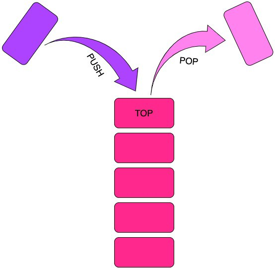

# Stacks

Unlike disorganized humans, computers need an order and a method to do everything. One way that computers organize and store information is through /stacks/.

A stack is a data structure that /stacks/ information, one piece at a time. The oldest piece is always at the bottom, with each layer on top of it being newer and newer. Here is an example of a stack:



This data structure can be worked with quickly and efficiently. By accessing what is always the most recent information or command, computers can operate in O(1) time. Here are some examples of stacks at work.

## Example

In the example below, we will use stacks to keep track of the algorthim that a person might use to do their homework. Here are the requirements:

- Each step of the homework process must be added and removed from the stack
- The student must complete homework in Math, English and Science
- The Math assignment will require a calculator to solve problems on a worksheet
- The English assignment will require an essay to be written on a laptop
- The Science assignment will require a video to be watched and a quiz to be completed

Each step in the homeowrk process must be added to the stack and later removed when the step is undone. Once the process is complete, the stack should be empty.

```python
homework = []
homework.append("Sit at desk")
homework.append("Pull out pencil")
homework.append("Pull out math assignment")
homework.append("Complete assignment")
homework.pop("Complete assignment")
homework.pop("Pull out math assignment")
homework.pop("Pull out pencil")
homework.append("Open Laptop")
homework.append("Outline essay")
homework.append("Write Essay")
homework.pop("Outline essay")
homework.pop("Write Essay")
homework.append("Watch Science video")
homework.append("Take notes")
homework.append("Take quiz")
homework.pop("Watch Science video")
homework.pop("Take notes")
homework.pop("Take quiz")
homework.pop("Open Laptop")
homework.pop("Sit at desk")
//Check to see if all has been completed
if len(homework == 0):
    return True
```

## Practice

Now it is time for you to solve a problem using a stack. Your family is going to their favorite spot to light a fire and make some s'mores. You need to manage your car's cargo space in order to make sure that when you need somthing, it is right at the front of your car's trunk.

You will need to bring everything to light a fire and make smores. You must submit a stack containing everything needed in the right order.

For a solution, click [here](StackSolution.py)
