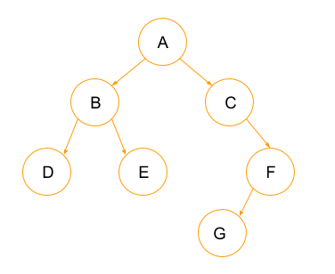

# Trees

One of the most important and versatile forms of data structures is a tree. Trees organize data by having each piece of information be connected to a parent node of information and 2 child nodes. Here is an example of a small tree.



A you can see, the tree is organized with the first pieces of information being at the top. When you search a tree, you start from the top and you start working down. This data structure is valuable because the most commonly accessed information can be kept at the top, where it is quickly found.

In addition to letting the  most important information being easily found, trees are also excellent data structures to use because a perfectly ballanced tree (a tree that is organized in such a way that one side is not longer than another) has O log(n) notation, which is significantly better than most other forms of data storage.

## Example

Once again, we will write the code needed to fill and search our data structure. We need code that allows us to create binary search trees (trees with 2 children for every parent) and search those trees for information.

```python

class BST:
    """
    First we must define this class and creat the BST.Node class
    """

    class Node:
        """
        Each node of the BST must have its own data and its own links to the 
        left and right sub-tree. 
        """

        def __init__(self, data):
            """ 
            We must initialize the node to the data provided.  Initially
            the links are unknown so they are set to None.
            """
            self.data = data
            self.left = None
            self.right = None

    def __init__(self):
        """
        We also nee to initialize an empty BST.
        """
        self.root = None

    def insert(self, data):
        """
        Insert 'data' into the BST.  If the BST
        is empty, then set the root equal to the new 
        node.  Otherwise, use _insert to recursively
        find the location to insert.
        """
        if self.root is None:
            self.root = BST.Node(data)
        elif self.__contains__(data):
            do_nothing = 0
        else:
            self._insert(data, self.root)  # Start at the root

    def _insert(self, data, node):
        """
        This function will look for a place to insert a node
        with 'data' inside of it.  The current sub-tree is
        represented by 'node'.  This function is intended to be
        called the first time by the insert function.
        """
        if data < node.data:
            # The data belongs on the left side.
            if node.left is None:
                # We found an empty spot
                node.left = BST.Node(data)
            else:
                # Need to keep looking.  Call _insert
                # recursively on the left sub-tree.
                self._insert(data, node.left)
        else:
            # The data belongs on the right side.
            if node.right is None:
                # We found an empty spot
                node.right = BST.Node(data)
            else:
                # Need to keep looking.  Call _insert
                # recursively on the right sub-tree.
                self._insert(data, node.right)

    def __contains__(self, data):
        """ 
        Checks if data is in the BST.  This function
        supports the ability to use the 'in' keyword:

        if 5 in my_bst:
            ("5 is in the bst")

        """
        return self._contains(data, self.root)  # Start at the root

    def _contains(self, data, node):
        """
        This funciton will search for a node that contains
        'data'.  The current sub-tree being search is 
        represented by 'node'.  This function is intended
        to be called the first time by the __contains__ function.
        """
        if data == node.data:
            return True
        elif data < node.data:
            # The data belongs on the left side.
            if node.left is None:
                # We found an empty spot
                return False
            else:
                # Need to keep looking.  Call _contains
                # recursively on the left sub-tree.
                return self._contains(data, node.left)
        else:
            # The data belongs on the right side.
            if node.right is None:
                # We found an empty spot
                return False
            else:
                # Need to keep looking.  Call _insert
                # recursively on the right sub-tree.
                return self._contains(data, node.right)

```

Using these simple functions, we can populate a tree with numbers, letters, or even strings. The code will keep the data stored and it will not add a value to the tree that is already within the data set.

An example call of the above class would look something like this:

```python

tree = BST()
tree.insert(6)
tree.insert(5)
tree.insert(7)
tree.insert(4)

print(6 in tree) # True
print(8 in tree) # False

```

## Practice

For your practice assignment, calculate the big O notation of a binary search tree. Using the code above as a starting point, add a way to keep track of how many times the code has to run in order to find if a tree contains information.

For a solution, click [here](unfinished.com)   